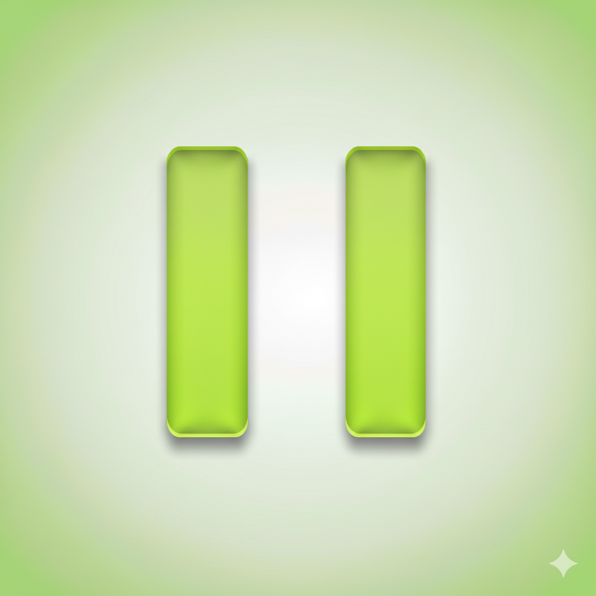

<p align="center">
  
</p>

<p align="center">
  <h1 align="center">Pause</h1>
  <p align="center">
    A macOS break enforcer that actually locks you out. Smart activations, customizable, and private.
  </p>
</p>

<p align="center">
  
  
  
  
</p>

---

## Overview

**Pause** firmly enforces breaks for better productivity, health, and awareness. Fullscreen sessions with breathing animations, ambient sounds, and intelligent activation patterns including doom scroll detection.


---

## 🎬 Videos

<p align="center">
  <a href="https://www.youtube.com/watch?v=Pvcd4aqd_L8">
    
  </a>
  <br>
  <em>Launch Video</em>
</p>

<p align="center">
  <a href="https://www.youtube.com/watch?v=O2XzWBNgfM4">
    
  </a>
  <br>
  <em>Demo Video</em>
</p>

---

## ✨ Features

### Can Lock You
- **Fullscreen enforcement** - No skipping, no bypassing (configurable)
- **Global hotkey** (`⌘⇧P`) - Start sessions from anywhere
- **Flexible duration** - 30s to 10h with optional variance

### Smart Activations
- **Repeated** - Every X minutes
- **Random** - Unpredictable intervals
- **Scheduled** - Specific daily times with labels
- **On app launch** - Trigger when opening specific apps
- **Doom scroll detection** - Catches endless scrolling

### Smart Anti-Activations
- **Don't interrupt** - Pause activations when you're typing (1-60s threshold)
- **Scheduled prevention** - Block breaks during meetings or focus time

### Customizability
- **Custom messages** - Set your own prompts ("stretch", "drink water")
- **Audio selection** - 7 ambient sounds (rain, birds, waves, etc.) with volume control
- **Custom hotkeys** - Any modifier-key combination
- **Menu bar** - Optional countdown timer or icon

---

## 📋 Requirements

- **macOS** 13.0 (Ventura) or later
- **Xcode** 16.4, Swift 5.0 (for development)

---

<!-- ## 🚀 Installation

### For Users
1. Download from [Releases](../../releases)
2. Drag `Pause.app` to `/Applications`
3. Launch and configure preferences
4. Grant accessibility permissions for global hotkey

### For Developers (macOS App)
```bash
git clone https://github.com/yourusername/Pause.git
cd Pause
open Pause.xcodeproj
# Press ⌘R to build and run
```

### For Developers (Website)
```bash
cd website
npm install
npm run dev
# Visit http://localhost:5173
```

**Environment Setup**: Create `website/.env` with:
```
VITE_SUPABASE_URL=your_supabase_url
VITE_SUPABASE_ANON_KEY=your_supabase_anon_key
```

--- -->

## 📖 Quick Start

1. Launch Pause
2. Set session duration in Session tab (default: 1 minute)
3. Press `⌘⇧P` anywhere to start a session
4. Breathe with the interface until timer completes
5. Press **E** to exit early (won't count toward stats)

### Setting Up Automatic Sessions

Navigate to **Activation** tab:

- **Repeated**: Enable and set interval (e.g., every 60 minutes)
- **Random**: Enable and set min-max range (e.g., 30-120 minutes)
- **Scheduled**: Click "+" to add specific times with custom labels

All three modes can run simultaneously.

---

## 🔧 Building and Testing

### App

```bash
# Build (Debug)
xcodebuild -project Pause.xcodeproj -scheme Pause -configuration Debug build

# Build (Release)
xcodebuild -project Pause.xcodeproj -scheme Pause -configuration Release build

# Run all tests
xcodebuild test -project Pause.xcodeproj -scheme Pause
```

**Note**: Uses modern **Swift Testing framework** (not XCTest).

## Website

```bash
cd website
npm install
npm run dev
# Visit http://localhost:5173
```

**Environment Setup**: Create `website/.env` with:
```
VITE_SUPABASE_URL=your_supabase_url
VITE_SUPABASE_ANON_KEY=your_supabase_anon_key
```

---

## 🎨 Architecture

Built with SwiftUI and singleton-based state management:

- **AppState** - Session lifecycle, audio playback, fullscreen management
- **Settings** - UserDefaults-backed preferences with auto-persistence
- **ActivationScheduler** - Orchestrates three independent timer modes
- **GlobalHotkeyManager** - Carbon-based global hotkey registration
- **MenuBarManager** - Optional menu bar integration

### Project Structure

**macOS App**:
```
Pause/
├── Pause/
│   ├── PauseApp.swift              # App entry point
│   ├── ContentView.swift           # Root view (settings + breathing UI)
│   ├── AppState.swift              # Session state management
│   ├── Settings.swift              # Preferences & persistence
│   ├── ActivationScheduler.swift  # Timer orchestration
│   ├── GlobalHotkeyManager.swift  # Hotkey registration
│   ├── MenuBarManager.swift       # Menu bar integration
│   ├── Views/                      # SwiftUI components
│   ├── Utilities/                  # Helper utilities
│   └── Resources/                  # Audio files (.mp3)
├── PauseTests/                     # Unit tests
└── PauseUITests/                   # UI automation tests
```

**Website** (Vue 3 + TypeScript):
```
website/
├── src/
│   ├── views/
│   │   ├── Home.vue                # Landing page (three-column layout)
│   │   └── Install.vue             # Waitlist signup
│   ├── lib/
│   │   └── supabase.ts             # Supabase client
│   ├── App.vue                     # Root component
│   └── main.ts                     # Entry point
├── public/                         # Static assets (logo, favicon)
├── index.html                      # HTML template
└── vite.config.ts                  # Vite configuration
```

---

## 🤝 Contributing

We welcome contributions to both the macOS app and website!

1. Fork the repository
2. Create feature branch: `git checkout -b feature/YourFeature`
3. Make your changes:
   - **App**: SwiftUI components, features, or bug fixes
   - **Website**: Vue components, styling, or content updates
4. Test your changes thoroughly
5. Commit with clear descriptions
6. Push to fork: `git push origin feature/YourFeature`
7. Open Pull Request

**Areas we'd love help with**:
- Additional ambient sound options
- UI/UX improvements
- Documentation and translations
- Bug fixes and performance optimizations

---

## 💬 Support

- **Bug Reports**: [Open an issue](../../issues)
- **Feature Requests**: [Start a discussion](../../discussions)

---

<p align="center">
  Built with ❤️ for macOS
</p>
